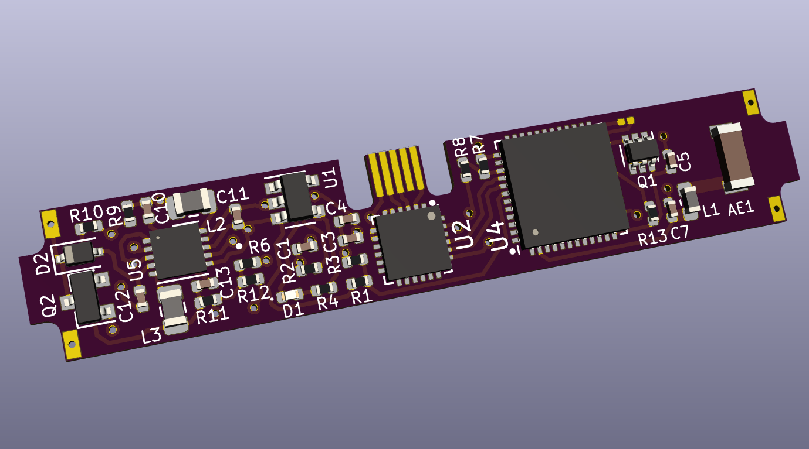
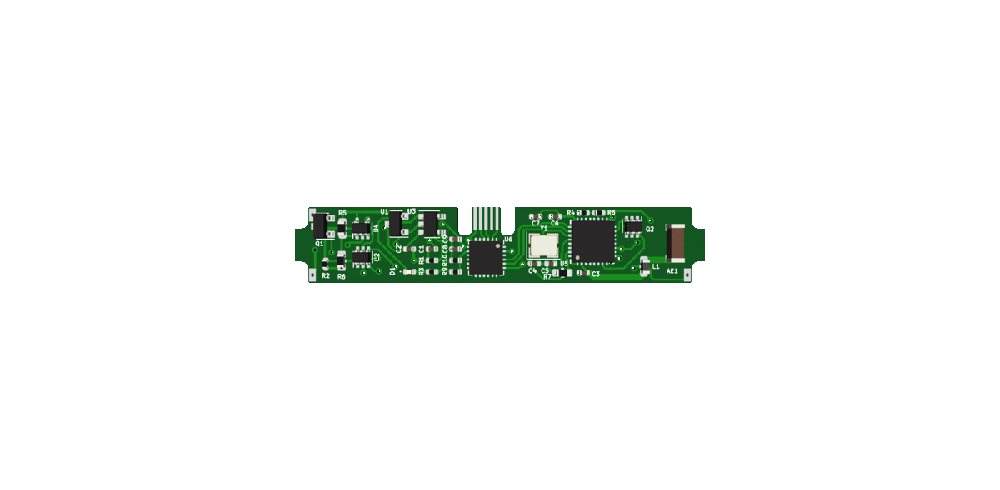

# Double-Oh Battery

## Hardware version 2.5, Firmware version 0.6

This is the spiritual successor to the [SMOL](https://github.com/heyspacebuck/SMOL), a tiny PCB that interrupts battery output to make fun patterns. By designing around a 10mm-by-44mm LiPo cell, I've been able to add Wi-Fi connectivity, a USB connection for charging and programming, and a dangerous (but intriguing!) overvoltage mode.

The star of the show is the ESP32-PICO-32, a 7mm-by-7mm powerhouse. It handles the wireless networking and various GPIOs.

Hardware developed in KiCad 5.1; firmware built in the Arduino IDE. Licensed/Licenced with the [CERN OHL](https://www.ohwr.org/project/cernohl/wikis/home).

## To do:

* Additional safety features on the firmware side
* Create an external BOM for easy part ordering
* Generate renders
* Improve installation instructions
* If it works, get OSHW certification!

